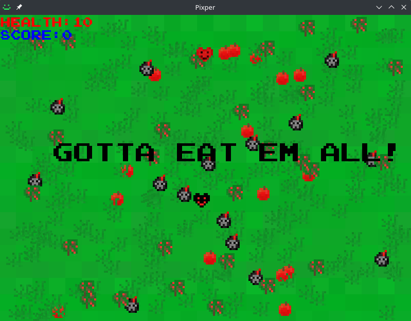
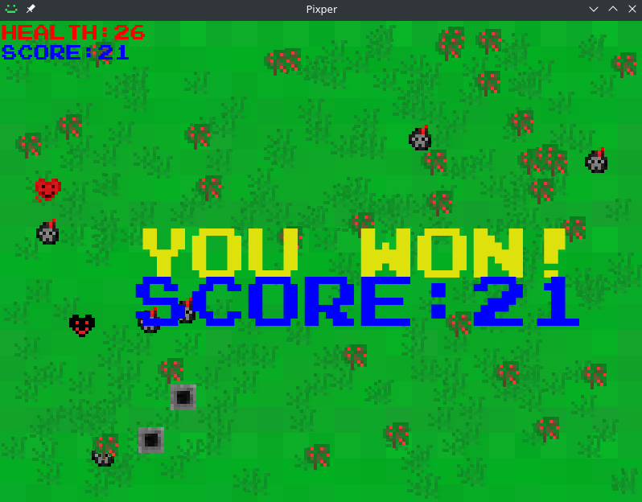
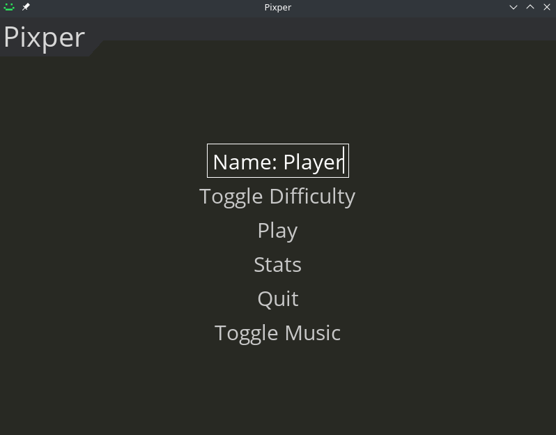

# Introduction to Pixper
**Pixper** is a 2D graphical game in which the objective is to collect all apples generated on a board resembling flatlands, while avoiding dangerous obstacles and entities.

# Goal
The game is controlled entirely via WASD, although you can also use the key Q to quit. The project was made in Python using `pygame`, `pygame-menu` and `sqlite3`, in addition to the standard Python3 libraries.

# Screenshots

Game's beginning

The end of the game, in this case a win

The game's initial menu

The game's stats submenu

# How do I play?
The game is only available for Windows and Linux. A port for Android is planned.

# Instructions for Windows
* Download: https://andrewstephen.xyz/pixper.zip
* Unzip the file
* Go into the main directory
* Run `main.exe` (in case Windows complains about the program being malicious, run anyway, the reason for such an error is that I have not purchased a certificate to verify this program with Microsoft - in case that sounds spooky to you - read the _Building on Windows_ instructions - you can "compile" a build of your own)
* **Enjoy!**
# Building on Windows
* Install Python: https://www.python.org/downloads/windows/
* Install pip: https://pip.pypa.io/en/stable/installation/
* Install git: https://gitforwindows.org/
* Open Powershell or Windows Terminal, NOT cmd
* `pip install pygame pygame-menu auto-py-to-exe`
* Alternatively, run `py -m pip install pygame pygame-menu auto-py-to-exe`
* `cd C:\Users\_your username_\Downloads`
* `git clone https://github.com/andrewstephengames/pixper`
* For the script location select `C:\Users\_your username_\Downloads\pixper\`
* You can select either _One directory_ or _One file_, though _One directory_ works better
* Tick on Additional files and select the `C:\Users\_your username_\Downloads\pixper\res` directory
* In the right side box make sure that you input `./`, otherwise the game will not start, as it doesn't know where the assets are
* Leave everything else on default
* You should now have a main directory under the current working directory, and inside of it you can find the `main.exe` executable
* **Enjoy!**

# Instructions for Linux
* Open your favorite terminal emulator
* `sudo apt install python3-pip` (Debian/Ubuntu - for other distros look up _distroname install pip_)
* `pip install pygame pygame-menu`
* `git clone https://github.com/andrewstephengames/pixper`
* `python main.py`
* **Enjoy!**
# Building on Linux
* `pip install auto-py-to-exe`
* `auto-py-to-exe`
* For the script location select _path where you cloned the repository_`/pixper/`
* You can select either _One directory_ or _One file_, though _One directory_ works better
* Tick on Additional files and select the _path where you cloned the repository_`/pixper/res` directory
* In the right side box make sure that you input `./`, otherwise the game will not start, as it doesn't know where the assets are
* Leave everything else on default
* You should now have a main directory under the current working directory, and inside of it you can find the `main` executable
* **Enjoy!**

# Background
**Because of the nature of the project, the codebase is very messy. You have been warned.** The game was meant initially only for my computer science certification in high school, although at the recommendation of my teachers I modified it for some contests also.  As such, because of time limitations and because I had to study for the final exam in high school, I had to forgo any and all programming conventions that could have made my code at least half-readable.

On that note, for one of the contests that was national, I forked my own project in order to translate it to French (I went to the French language section to guarantee at least 3rd place, and I got 2nd place) and also changed some of the assets in order to make it friendly for the contest's evaluation commission. The fork's name is [**pixper-fr**](https://github.com/andrewstephengames/pixper-fr).

This project was made completely solo, including the textures, logic, database, menus, command-line functionality, distribution and documentation. **It ain't much but it's honest work**. Feel free to fork.
